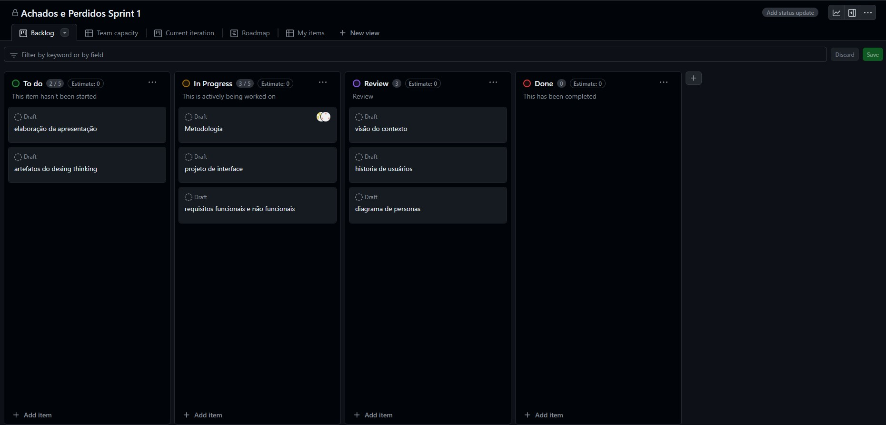

# Metodologia

A metodologia determina as ferramentas que auxiliarão a equipe na manutenção dos códigos, artefatos e na organização do trabalho e das tarefas do projeto.

## Relação de Ambientes de Trabalho
Os artefatos do projeto são desenvolvidos a partir de diversas plataformas e a relação dos ambientes com seu respectivo propósito é apresentada na tabela que se segue. 

| Ambiente   | Plataforma   | Link de Acesso |
| -------- | -------- | --------- |
| Repositório de código fonte | GitHub |https://github.com/ICEI-PUCMinas-PSG-SI-TI/icei-pucminas-psg-si-n-tiaw-2024-1-grupo-8-achados-e-perdidos/tree/master|
| Documentos do projeto | GitHub |https://github.com/ICEI-PUCMinas-PSG-SI-TI/icei-pucminas-psg-si-n-tiaw-2024-1-grupo-8-achados-e-perdidos/tree/master|
| Projeto de Interface e  Wireframes | Figma |https://www.figma.com/proto/yVosVg5piTvUuxNzJVHZLA/Untitled?type=design&node-id=5-157&t=2i0HAQe4wUQEMS2I-1&scaling=scale-down&page-id=0%3A1&starting-point-node-id=3%3A37&mode=design|
| Gerenciamento do Projeto | GitHub |https://github.com/orgs/ICEI-PUCMinas-PSG-SI-TI/projects/42/views/1|
| Ferramentas de comunicação | WhatsApp/Discord |https://discord.gg/Dapzxabp|
| Editor de código | Visual Studio Code |https://code.visualstudio.com|

## Gestão de código fonte
Para gerenciar o código-fonte do software que a equipe desenvolve, usamos um processo chamado Git Feature Branch Workflow, conforme ilustrado na Figura 1. Esse método garante que todas as alterações no código sejam feitas em ramificações separadas.

Figura 1 - Fluxo de controle do código fonte no repositório git

## Gerenciamento do Projeto
A equipe utiliza metodologias ágeis, tendo escolhido o Scrum como base para definição do processo de desenvolvimento.

A equipe está organizada da seguinte maneira:

| Membro   | Função   | Descrição |
| -------- | -------- | --------- |
| Professores | Líderes de Projeto |Responsáveis pela orientação e acompanhamento do projeto.|
| Danilo Riguette | Scrum Master e Dev |Responsável pela organização e gestão do projeto, além de contribuir com o desenvolvimento.|
| Júlia Raquel | Designer e Dev |Responsável pela criação da interface do usuário e pelo desenvolvimento de funcionalidades.|
| Igor Barroso | Dev |Responsável pela escrita do código do projeto.|
| Gustavo | Dev |Responsável pela escrita do código do projeto.|
| Pedro Florêncio |Dev |Responsável pela escrita do código do projeto.|
| João Paulo | Dev|Responsável pela escrita do código do projeto.|

Para organização e distribuição das tarefas do projeto, a equipe está utilizando o GitHub estruturado com as seguintes listas: 

* To Do: Esta lista representa as tarefas ainda não iniciadas.
* In Progress: Quando uma tarefa tiver sido iniciada, ela é movida para cá.
* Review: Checagem de Qualidade. Quando as tarefas são concluídas. No final de cada semana, haverá uma reunião para analisar cada tarefa desta lista, garantindo assim, que tudo saia perfeito.
* Done: Nesta lista são colocadas as tarefas que passaram pelos testes e controle de qualidade e estão prontos para serem entregues ao usuário. Não há mais edições ou revisões necessárias, ele está agendado e pronto para a ação.
.

O quadro kanban do grupo no GitHub está disponível através da URL https://github.com/orgs/ICEI-PUCMinas-PSG-SI-TI/projects/42/views/1 e é apresentado, no estado atual, na Figura 2. 

